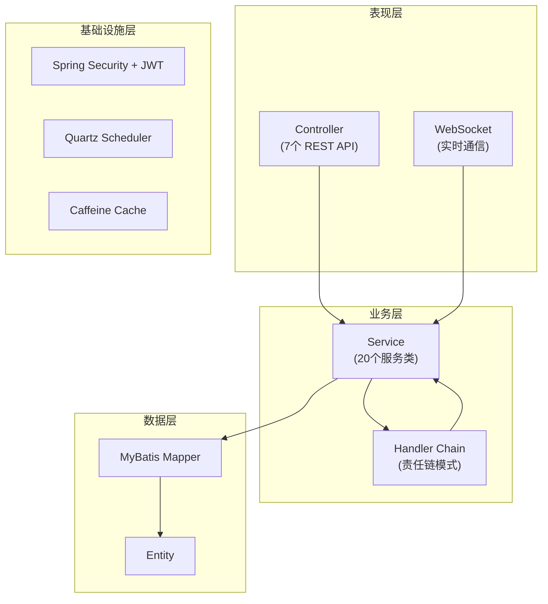
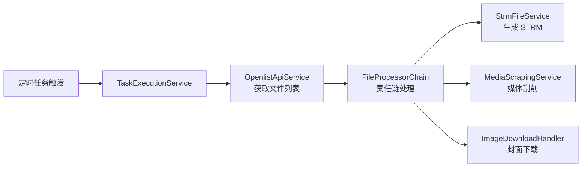

# OStrm 后端架构文档

## 概述

OStrm (OpenList to Strm) 是一个基于 **Spring Boot** 的后端服务，主要功能是将 OpenList 中的媒体文件转换为 STRM 流媒体文件，并提供媒体刮削、任务调度等功能。

---

## 技术栈

### 核心框架
| 技术 | 版本 | 描述 |
|------|------|------|
| Spring Boot | 3.3.9 | 核心应用框架 |
| Java | 21 | 编程语言版本 |
| Gradle | - | 构建工具 (Kotlin DSL) |

### 数据层
| 技术 | 版本 | 描述 |
|------|------|------|
| SQLite | 3.47.1 | 嵌入式数据库 |
| MyBatis | 3.0.4 | ORM 框架 |
| Flyway | 11.4.0 | 数据库迁移工具 |
| HikariCP | - | 连接池 (Spring Boot 内置) |

### 安全认证
| 技术 | 版本 | 描述 |
|------|------|------|
| Spring Security | - | 安全框架 |
| JWT (java-jwt) | 4.4.0 | Token 认证 |

### 任务调度
| 技术 | 描述 |
|------|------|
| Spring Quartz | 定时任务调度框架 |

### 其他组件
| 技术 | 版本 | 描述 |
|------|------|------|
| Caffeine | 3.2.0 | 本地缓存 |
| SpringDoc OpenAPI | 2.6.0 | API 文档 (Swagger UI) |
| WebSocket | - | 实时通信 |
| Spring Mail | - | 邮件服务 |

### 开发工具
| 技术 | 版本 | 描述 |
|------|------|------|
| Lombok | - | 代码简化 |
| Spotless | 7.0.2 | 代码格式化 |
| PMD | 7.9.0 | 静态代码分析 |
| JaCoCo | 0.8.12 | 测试覆盖率 |
| Testcontainers | 1.20.6 | 集成测试容器 |

---

## 项目结构

```
backend/
├── src/main/java/com/hienao/openlist2strm/
│   ├── ApplicationService.java      # 应用入口
│   ├── component/                   # 通用组件
│   ├── config/                      # 配置类 (18个)
│   │   ├── security/                # 安全配置
│   │   │   ├── WebSecurityConfig.java
│   │   │   ├── Jwt.java
│   │   │   ├── JwtAuthenticationFilter.java
│   │   │   └── ...
│   │   ├── QuartzConfig.java
│   │   ├── CacheConfig.java
│   │   └── ...
│   ├── constant/                    # 常量定义
│   ├── controller/                  # 控制器层 (7个)
│   │   ├── SignController.java      # 登录认证
│   │   ├── TaskConfigController.java # 任务配置
│   │   ├── OpenlistConfigController.java
│   │   ├── SystemConfigController.java
│   │   ├── LogController.java
│   │   ├── DataReportController.java
│   │   └── VersionController.java
│   ├── dto/                         # 数据传输对象 (18个)
│   │   ├── sign/                    # 登录相关 DTO
│   │   ├── task/                    # 任务相关 DTO
│   │   ├── tmdb/                    # TMDB API DTO
│   │   └── ...
│   ├── entity/                      # 实体类 (2个)
│   ├── exception/                   # 异常处理
│   ├── handler/                     # 处理器链 (16个)
│   │   ├── FileProcessorChain.java  # 责任链入口
│   │   ├── FileDiscoveryHandler.java
│   │   ├── StrmGenerationHandler.java
│   │   ├── MediaScrapingHandler.java
│   │   ├── ImageDownloadHandler.java
│   │   └── ...
│   ├── job/                         # 定时任务 (5个)
│   │   ├── TaskConfigJob.java       # 任务执行
│   │   ├── VersionCheckJob.java     # 版本检查
│   │   ├── LogCleanupJob.java       # 日志清理
│   │   ├── DataBackupJob.java
│   │   └── EmailJob.java
│   ├── listener/                    # 事件监听器
│   ├── mapper/                      # MyBatis Mapper (2个)
│   ├── service/                     # 服务层 (20个)
│   │   ├── TaskExecutionService.java   # 核心任务执行
│   │   ├── StrmFileService.java        # STRM 文件生成
│   │   ├── MediaScrapingService.java   # 媒体刮削
│   │   ├── OpenlistApiService.java     # OpenList API
│   │   ├── TmdbApiService.java         # TMDB API
│   │   └── ...
│   ├── util/                        # 工具类 (4个)
│   └── validation/                  # 验证器 (2个)
├── src/main/resources/
│   ├── application.yml              # 主配置文件
│   ├── application-prod.yml         # 生产环境配置
│   ├── db/migration/                # Flyway 迁移脚本 (8个)
│   ├── mapper/                      # MyBatis XML (2个)
│   └── logback-spring.xml           # 日志配置
└── build.gradle.kts                 # Gradle 构建脚本
```

---

## 架构设计

### 分层架构



### 核心业务流程



---

## 核心模块说明

### 1. 任务调度系统

- **QuartzSchedulerService**: Quartz 任务调度服务
- **TaskConfigJob**: 主任务执行 Job
- **TaskExecutionService**: 任务执行核心逻辑
  - 支持全量/增量执行模式
  - 异步任务提交
  - 内存优化的批量文件处理

### 2. 文件处理链 (责任链模式)

```
FileDiscoveryHandler → FileFilterHandler → FilePriorityResolver
       ↓
StrmGenerationHandler → MediaScrapingHandler → ImageDownloadHandler
       ↓
NfoDownloadHandler → SubtitleCopyHandler → OrphanCleanupHandler
```

### 3. 媒体刮削服务

- **TmdbApiService**: TMDB API 集成
- **MediaScrapingService**: 媒体信息刮削
- **NfoGeneratorService**: NFO 文件生成
- **CoverImageService**: 封面图片处理
- **AiFileNameRecognitionService**: AI 文件名识别

### 4. 安全架构

- **JWT Token 认证**: 无状态 Token 验证
- **JwtAuthenticationFilter**: 请求过滤器
- **WebSecurityConfig**: 安全规则配置
- **用户密码**: BCrypt 加密

---

## 数据库设计

### 迁移脚本历史

| 版本 | 描述 |
|------|------|
| V1_0_0 | 初始化 Schema |
| V1_0_1 | 用户权限表 |
| V1_0_2 | Quartz 调度表 |
| V1_0_3 | OpenList 配置表 |
| V1_0_4 | 任务配置表 |
| V1_0_5 | 重命名正则字段 |
| V1_0_6 | STRM BaseURL 字段 |
| V1_0_7 | URL 编码开关字段 |

---

## API 接口

API 文档通过 **SpringDoc OpenAPI** 自动生成，访问路径：

- Swagger UI: `/swagger-ui.html`

### 主要接口分类

| Controller | 描述 |
|------------|------|
| SignController | 用户登录/登出/Token 刷新 |
| TaskConfigController | 任务配置 CRUD |
| OpenlistConfigController | OpenList 连接配置 |
| SystemConfigController | 系统设置 |
| LogController | 日志查询 |
| DataReportController | 数据报表 |
| VersionController | 版本信息 |

---

## 配置说明

### 核心配置项 (application.yml)

```yaml
app:
  paths:
    data: /maindata           # 数据目录
    database: /maindata/db/openlist2strm.db
    strm: /app/backend/strm   # STRM 输出目录

spring:
  datasource:
    url: jdbc:sqlite:${app.paths.database}

jwt:
  secret: ${JWT_SECRET}       # JWT 密钥 (环境变量)
  expiration-min: 20160       # 14天过期
```

---

## 部署信息

- **构建产物**: `openlisttostrm.jar`
- **运行端口**: 8080
- **容器化**: 支持 Docker 部署
- **Profile**: `prod` (生产环境)
