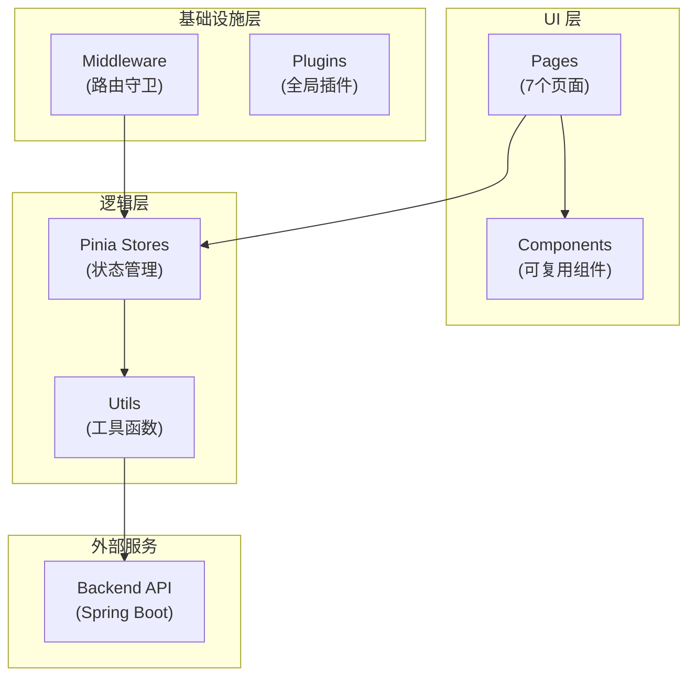
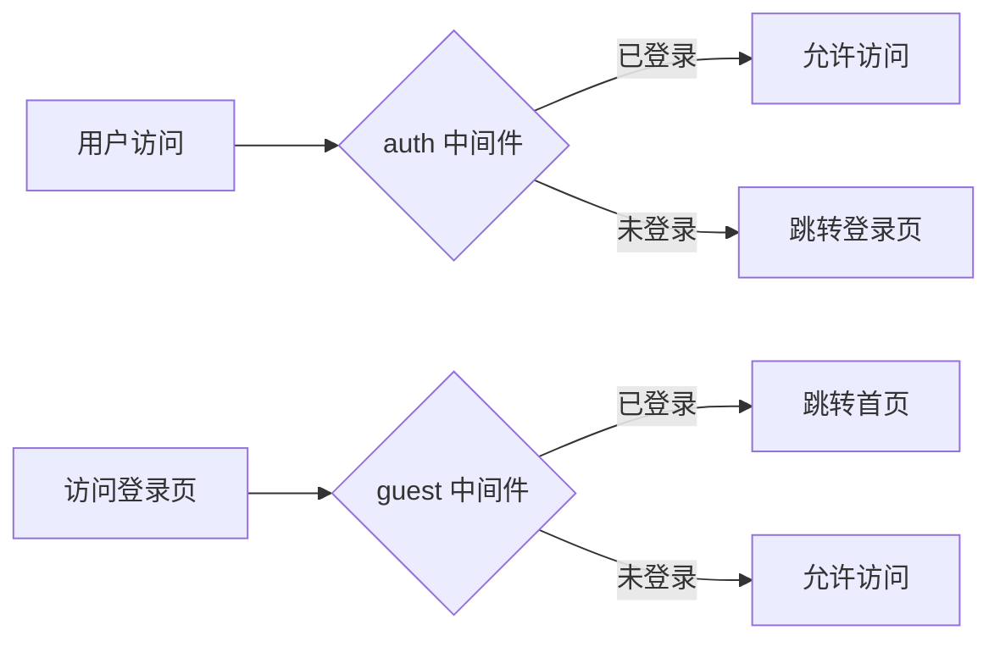

# OStrm 前端架构文档

## 概述

OStrm 前端是一个基于 **Nuxt 3** 框架的单页应用 (SPA)，采用 **Vue 3 Composition API** 开发，使用 **TailwindCSS** 构建现代化 UI。

---

## 技术栈

### 核心框架
| 技术 | 版本 | 描述 |
|------|------|------|
| Nuxt | 3.13.0 | Vue 全栈框架 |
| Vue | 3.4.0 | 渐进式 JavaScript 框架 |
| Vue Router | 4.4.0 | 路由管理 |
| TypeScript | - | 类型安全支持 |

### 状态管理
| 技术 | 版本 | 描述 |
|------|------|------|
| Pinia | 2.1.7 | Vue 官方状态管理库 |
| @pinia/nuxt | 0.5.1 | Pinia Nuxt 集成 |

### UI 框架
| 技术 | 版本 | 描述 |
|------|------|------|
| TailwindCSS | 3.4.15 | 原子化 CSS 框架 |
| @tailwindcss/forms | 0.5.9 | 表单样式插件 |

### 性能优化
| 技术 | 版本 | 描述 |
|------|------|------|
| vue-virtual-scroller | 2.0.0-beta.8 | 虚拟滚动组件 |

---

## 项目结构

```
frontend/
├── app.vue                    # 应用入口组件
├── nuxt.config.ts             # Nuxt 配置文件
├── tailwind.config.js         # TailwindCSS 配置
├── tsconfig.json              # TypeScript 配置
├── package.json               # 依赖管理
│
├── assets/                    # 静态资源
│   └── css/
│       └── main.css           # 全局样式
│
├── components/                # 可复用组件 (1个)
│   └── AppHeader.vue          # 应用头部导航
│
├── pages/                     # 页面组件 (7个)
│   ├── index.vue              # 首页 (任务概览)
│   ├── login.vue              # 登录页
│   ├── register.vue           # 注册页
│   ├── settings.vue           # 系统设置
│   ├── logs.vue               # 日志查看
│   ├── change-password.vue    # 修改密码
│   └── task-management/       # 任务管理
│       └── index.vue
│
├── middleware/                # 路由中间件 (3个)
│   ├── auth.js                # 认证守卫
│   ├── guest.js               # 游客守卫
│   └── docker-port.global.js  # Docker 端口修复
│
├── plugins/                   # Nuxt 插件 (3个)
│   ├── auth.client.js         # 认证初始化
│   ├── docker-port-fix.client.js  # Docker 兼容
│   └── logger.client.js       # 前端日志
│
├── stores/                    # Pinia 状态仓库 (2个)
│   ├── auth.js                # 认证状态
│   └── version.js             # 版本状态
│
├── utils/                     # 工具函数 (3个)
│   ├── api.js                 # API 请求封装
│   ├── token.js               # Token 管理
│   └── logger.js              # 日志工具
│
├── public/                    # 公共资源
│   └── favicon.ico
│
└── server/                    # 服务端 API
    └── api/                   # BFF 接口
```

---

## 架构设计

### 应用架构



### 路由守卫流程



---

## 核心模块说明

### 1. 状态管理 (Pinia Stores)

#### auth.js - 认证状态
- 用户登录/登出
- Token 管理
- 用户信息存储

#### version.js - 版本状态
- 应用版本号
- 版本更新检查

### 2. 路由中间件

| 中间件 | 作用 |
|--------|------|
| `auth.js` | 保护需要登录的页面 |
| `guest.js` | 已登录用户跳过登录页 |
| `docker-port.global.js` | 修复 Docker 端口映射重定向 |

### 3. 工具模块

| 工具 | 功能 |
|------|------|
| `api.js` | API 请求封装，自动携带 Token |
| `token.js` | Token 存储、验证、刷新 |
| `logger.js` | 前端日志收集，上报后端 |

---

## 页面功能

| 页面 | 路由 | 功能描述 |
|------|------|----------|
| 首页 | `/` | 任务概览，快速操作 |
| 登录 | `/login` | 用户认证 |
| 注册 | `/register` | 新用户注册 |
| 设置 | `/settings` | 系统配置管理 |
| 日志 | `/logs` | 查看系统日志 |
| 修改密码 | `/change-password` | 密码变更 |
| 任务管理 | `/task-management` | 任务配置 CRUD |

---

## 配置说明

### Nuxt 配置 (nuxt.config.ts)

```typescript
export default defineNuxtConfig({
  // 客户端渲染模式 (SPA)
  ssr: false,
  
  // API 代理配置
  nitro: {
    devProxy: {
      '/api': 'http://localhost:8080/api'
    }
  },
  
  // 运行时配置
  runtimeConfig: {
    public: {
      apiBase: '/api'
    }
  },
  
  // 模块
  modules: [
    '@nuxtjs/tailwindcss',
    '@pinia/nuxt'
  ]
})
```

### TailwindCSS 配置

- **字体**: Inter (Google Fonts)
- **主色调**: Blue (#3b82f6)
- **动画**: fade-in, slide-up
- **插件**: @tailwindcss/forms

---

## 开发命令

```bash
# 开发环境
npm run dev

# 构建生产版本
npm run build

# 预览生产构建
npm run preview

# 生成静态站点
npm run generate
```

---

## 部署说明

- **构建产物**: `.output/` 目录
- **运行模式**: SPA (Client-Side Rendering)
- **预渲染页面**: `/login`, `/register`, `/settings`, `/change-password`, `/task-management`
- **容器化**: 通过 Nginx 或 Caddy 托管静态文件
