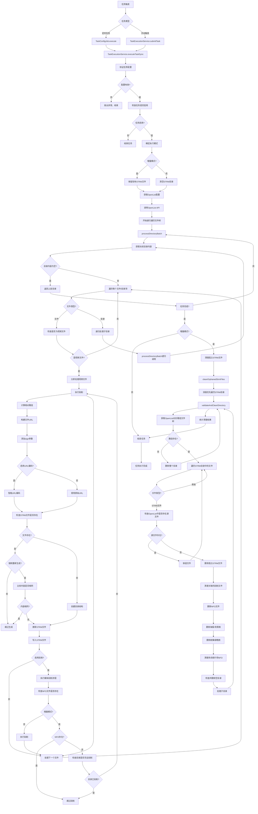

# OpenList文件树遍历流程分析

## 概述

Ostrm系统在处理OpenList文件树遍历时，经历了完整的文件发现、过滤、转换和清理流程。本文档详细分析了每一步操作，并提供了流程图展示。

## 核心组件

### 主要服务类
1. **TaskConfigJob** - Quartz定时任务触发器
2. **TaskExecutionService** - 任务执行核心服务
3. **OpenlistApiService** - OpenList API交互服务
4. **StrmFileService** - STRM文件生成和管理服务
5. **MediaScrapingService** - 媒体刮削服务（可选）

## 完整流程图



## 详细步骤分解

### 1. 任务触发阶段

#### 1.1 定时任务触发
```java
// TaskConfigJob.java:29-61
public void execute(JobExecutionContext context) {
    // 从JobDataMap获取任务ID
    Long taskConfigId = (Long) dataMap.get("taskConfigId");

    // 获取任务配置
    TaskConfig taskConfig = taskConfigService.getById(taskConfigId);

    // 检查任务是否启用
    if (!taskConfig.getIsActive()) {
        log.info("任务已禁用，跳过执行");
        return;
    }

    // 执行任务
    taskExecutionService.executeTask(taskConfig.getId(), taskConfig.getIsIncrement());
}
```

#### 1.2 手动任务提交
```java
// TaskExecutionService.java:58-72
public void submitTask(Long taskId, Boolean isIncrement) {
    // 使用线程池异步执行任务
    taskSubmitExecutor.execute(() -> {
        executeTaskSync(taskId, isIncrement);
    });
}
```

### 2. 任务验证阶段

#### 2.1 获取并验证OpenList配置
```java
// TaskExecutionService.java:329-344
private OpenlistConfig getOpenlistConfig(TaskConfig taskConfig) {
    // 检查任务配置中是否指定OpenList配置ID
    if (taskConfig.getOpenlistConfigId() == null) {
        throw new BusinessException("任务配置中未指定OpenList配置ID");
    }

    // 获取OpenList配置
    OpenlistConfig openlistConfig = openlistConfigService.getById(taskConfig.getOpenlistConfigId());

    // 验证配置是否启用
    if (!Boolean.TRUE.equals(openlistConfig.getIsActive())) {
        throw new BusinessException("OpenList配置已禁用");
    }

    return openlistConfig;
}
```

### 3. 文件树遍历阶段

#### 3.1 内存优化的分批处理
```java
// TaskExecutionService.java:467-502
private List<OpenlistFile> processFilesWithMemoryOptimization(...) {
    List<OpenlistFile> allFiles = new ArrayList<>();

    try {
        // 分批处理目录，避免一次性加载所有文件
        processDirectoryBatch(openlistConfig, taskConfig.getPath(), ...);

        log.info("文件处理完成 - 处理了 {} 个视频文件", processedCount);
    } catch (Exception e) {
        // 降级到原始方法
        allFiles = openlistApiService.getAllFilesRecursively(openlistConfig, taskConfig.getPath());
    }

    return allFiles;
}
```

#### 3.2 递归目录遍历
```java
// TaskExecutionService.java:505-556
private void processDirectoryBatch(...) {
    // 获取当前目录内容
    List<OpenlistFile> files = openlistApiService.getDirectoryContents(openlistConfig, path);

    for (OpenlistFile file : files) {
        allFiles.add(file);

        if ("file".equals(file.getType()) && strmFileService.isVideoFile(file.getName())) {
            // 立即处理视频文件，不累积在内存中
            processVideoFile(openlistConfig, file, taskConfig, ...);
        } else if ("folder".equals(file.getType())) {
            // 递归处理子目录
            String subPath = file.getPath();
            processDirectoryBatch(openlistConfig, subPath, ...);
        }
    }
}
```

#### 3.3 OpenList API交互
```java
// OpenlistApiService.java:207-296
public List<OpenlistFile> getDirectoryContents(OpenlistConfig config, String path) {
    // 构建API URL
    String apiUrl = config.getBaseUrl() + "/api/fs/list";

    // 设置请求头
    HttpHeaders headers = new HttpHeaders();
    headers.setContentType(MediaType.APPLICATION_JSON);
    headers.set("Authorization", config.getToken());

    // 构建请求体
    String requestBody = String.format(
        "{\"path\":\"%s\",\"password\":\"\",\"page\":1,\"per_page\":0,\"refresh\":false}",
        path);

    // 发送POST请求
    ResponseEntity<String> response = restTemplate.exchange(
        requestUrl, HttpMethod.POST, entity, String.class);

    // 解析响应
    AlistApiResponse apiResponse = objectMapper.readValue(responseBody, AlistApiResponse.class);

    // 转换Alist格式到OpenlistFile格式
    List<OpenlistFile> files = new ArrayList<>();
    for (AlistFile alistFile : apiResponse.getData().getContent()) {
        OpenlistFile file = new OpenlistFile();
        file.setName(alistFile.getName());
        file.setType(alistFile.getIsDir() ? "folder" : "file");
        file.setPath(path + "/" + alistFile.getName());
        file.setUrl(buildFileUrl(config.getBaseUrl(), filePath));
        file.setSign(alistFile.getSign());
        files.add(file);
    }

    return files;
}
```

### 4. 视频文件处理阶段

#### 4.1 计算相对路径
```java
// TaskExecutionService.java:569-574
private void processVideoFile(...) {
    // 计算相对路径
    String relativePath = strmFileService.calculateRelativePath(taskConfig.getPath(), file.getPath());

    // 构建包含sign参数的文件URL
    String fileUrlWithSign = buildFileUrlWithSign(file.getUrl(), file.getSign());
}
```

#### 4.2 URL构建与sign参数处理
```java
// TaskExecutionService.java:353-369
private String buildFileUrlWithSign(String originalUrl, String sign) {
    String processedUrl = originalUrl;

    // 添加sign参数
    if (sign != null && !sign.trim().isEmpty()) {
        String separator = processedUrl.contains("?") ? "&" : "?";
        processedUrl = processedUrl + separator + "sign=" + sign;
    }

    return processedUrl;
}
```

### 5. STRM文件生成阶段

#### 5.1 文件名处理
```java
// StrmFileService.java:113-141
private String processFileName(String originalFileName, String renameRegex) {
    String processedName = originalFileName;

    // 应用重命名规则
    if (StringUtils.hasText(renameRegex)) {
        if (renameRegex.contains("|")) {
            String[] parts = renameRegex.split("\\|", 2);
            String pattern = parts[0];
            String replacement = parts[1];
            processedName = processedName.replaceAll(pattern, replacement);
        }
    }

    // 移除原始扩展名并添加.strm扩展名
    int lastDotIndex = processedName.lastIndexOf('.');
    if (lastDotIndex > 0) {
        processedName = processedName.substring(0, lastDotIndex);
    }
    processedName += ".strm";

    return processedName;
}
```

#### 5.2 STRM文件路径构建
```java
// StrmFileService.java:151-175
public Path buildStrmFilePath(String strmBasePath, String relativePath, String fileName) {
    Path basePath = Paths.get(strmBasePath);

    if (StringUtils.hasText(relativePath)) {
        // 清理相对路径
        String cleanRelativePath = relativePath.replaceAll("^/+", "").replaceAll("/+$", "");
        // 确保路径使用UTF-8编码
        cleanRelativePath = new String(
            cleanRelativePath.getBytes(StandardCharsets.UTF_8),
            StandardCharsets.UTF_8);
        basePath = basePath.resolve(cleanRelativePath);
    }

    // 确保文件名使用UTF-8编码
    String safeFileName = new String(fileName.getBytes(StandardCharsets.UTF_8), StandardCharsets.UTF_8);
    return basePath.resolve(safeFileName);
}
```

#### 5.3 URL处理与编码
```java
// StrmFileService.java:64-71
public void generateStrmFile(...) {
    // 处理baseUrl替换
    String processedUrl = processUrlWithBaseUrlReplacement(fileUrl, openlistConfig);

    // 计算最终写入的URL（考虑编码配置）
    String finalUrl = processedUrl;
    if (shouldEncodeUrl(openlistConfig)) {
        finalUrl = encodeUrlForStrm(processedUrl);
    }

    // 检查文件是否已存在
    if (Files.exists(strmFilePath)) {
        if (!forceRegenerate) {
            log.info("STRM文件已存在，跳过生成: {}", strmFilePath);
            return;
        }
        // 比较内容是否相同
        String existingContent = Files.readString(strmFilePath, StandardCharsets.UTF_8).trim();
        if (existingContent.equals(finalUrl)) {
            log.debug("STRM链接未变化，跳过更新: {}", strmFilePath);
            return;
        }
    }

    // 确保目录存在
    createDirectoriesIfNotExists(strmFilePath.getParent());

    // 写入STRM文件
    writeStrmFileDirectly(strmFilePath, finalUrl);
}
```

#### 5.4 URL Base URL替换
```java
// StrmFileService.java:1015-1079
private String processUrlWithBaseUrlReplacement(String originalUrl, OpenlistConfig openlistConfig) {
    if (originalUrl == null || openlistConfig == null) {
        return originalUrl;
    }

    // 如果没有配置strmBaseUrl，直接返回原始URL
    if (openlistConfig.getStrmBaseUrl() == null
        || openlistConfig.getStrmBaseUrl().trim().isEmpty()) {
        return originalUrl;
    }

    try {
        // 解析原始URL
        java.net.URL url = new java.net.URL(originalUrl);
        String path = url.getPath();
        String query = url.getQuery();
        String ref = url.getRef();

        // 构建新的URL
        String newBaseUrl = openlistConfig.getStrmBaseUrl();
        if (!newBaseUrl.endsWith("/")) {
            newBaseUrl += "/";
        }

        // 确保路径不以/开头（避免双斜杠）
        if (path.startsWith("/")) {
            path = path.substring(1);
        }

        String newUrl = newBaseUrl + path;

        // 添加查询参数
        if (query != null && !query.isEmpty()) {
            newUrl += "?" + query;
        }

        // 添加锚点
        if (ref != null && !ref.isEmpty()) {
            newUrl += "#" + ref;
        }

        return newUrl;

    } catch (Exception e) {
        log.warn("URL替换失败，使用原始URL: {}, 错误: {}", originalUrl, e.getMessage());
        return originalUrl;
    }
}
```

### 6. 媒体刮削阶段（可选）

#### 6.1 刮削条件检查
```java
// TaskExecutionService.java:639-665
private boolean needScrapFile(String fileName, String renameRegex, String strmPath,
                               String relativePath, boolean isIncrement) {
    // 非增量模式下总是需要刮削
    if (!isIncrement) {
        return true;
    }

    try {
        // 增量模式下，检查NFO文件是否已存在
        String finalFileName = processFileNameForScraping(fileName, renameRegex);
        Path strmFilePath = strmFileService.buildStrmFilePath(strmPath, relativePath, finalFileName);

        // 构建对应的NFO文件路径
        Path nfoFilePath = strmFilePath.resolveSibling(
            strmFilePath.getFileName().toString().replace(".strm", ".nfo"));

        // 如果NFO文件存在，则跳过刮削
        return !java.nio.file.Files.exists(nfoFilePath);
    } catch (Exception e) {
        log.warn("检查NFO文件是否存在时发生错误: {}, 默认进行刮削", e.getMessage());
        return true;
    }
}
```

### 7. 增量清理阶段

#### 7.1 孤立文件清理主流程
```java
// StrmFileService.java:417-457
public int cleanOrphanedStrmFiles(...) {
    try {
        Path strmPath = Paths.get(strmBasePath);

        log.info("开始使用深度优先遍历清理孤立STRM文件: {}", strmBasePath);

        // 计算任务路径在OpenList中的相对路径（作为根路径）
        String openlistRootPath = taskPath;

        // 使用深度优先遍历清理STRM目录
        int cleanedCount = validateAndCleanDirectory(
            strmPath, openlistConfig, taskPath, openlistRootPath, renameRegex);

        return cleanedCount;

    } catch (Exception e) {
        log.error("清理孤立STRM文件失败", e);
        return 0;
    }
}
```

#### 7.2 深度优先目录验证
```java
// StrmFileService.java:956-1006
private int validateAndCleanDirectory(...) {
    AtomicInteger totalCleanedCount = new AtomicInteger(0);

    // 获取当前STRM目录下的所有子目录
    List<Path> subDirectories;
    try (java.util.stream.Stream<Path> stream = Files.list(strmDirectoryPath)) {
        subDirectories = stream
            .filter(Files::isDirectory)
            .sorted()
            .collect(java.util.stream.Collectors.toList());
    }

    // 深度优先：先处理所有子目录
    for (Path subDir : subDirectories) {
        String subDirName = subDir.getFileName().toString();
        String openlistSubPath = openlistRelativePath.isEmpty()
            ? subDirName
            : openlistRelativePath + "/" + subDirName;

        int cleanedCount = validateAndCleanDirectory(
            subDir, openlistConfig, taskPath, openlistSubPath, renameRegex);
        totalCleanedCount.addAndGet(cleanedCount);
    }

    // 处理当前目录的STRM文件
    int currentDirCleanedCount = cleanStrmFilesAndCheckDirectory(
        strmDirectoryPath, openlistConfig, taskPath, openlistRelativePath, renameRegex, taskPath);
    totalCleanedCount.addAndGet(currentDirCleanedCount);

    return totalCleanedCount.get();
}
```

#### 7.3 文件存在性检查
```java
// StrmFileService.java:846-897
private boolean checkFileExistsInOpenList(String strmBaseName,
                                         List<OpenlistFile> openlistFiles,
                                         String renameRegex) {
    return openlistFiles.stream()
        .filter(file -> "file".equals(file.getType()) && isVideoFile(file.getName()))
        .anyMatch(file -> {
            String openlistFileName = file.getName();
            String openlistBaseName = getBaseName(openlistFileName);

            // 1. 直接匹配基础名
            if (strmBaseName.equals(openlistBaseName)) {
                return true;
            }

            // 2. 如果有重命名规则，尝试反向匹配
            if (StringUtils.hasText(renameRegex) && renameRegex.contains("|")) {
                try {
                    String[] parts = renameRegex.split("\\|", 2);
                    String pattern = parts[0];
                    String replacement = parts[1];

                    // 尝试将STRM基础名反向还原
                    String restoredName = strmBaseName.replaceAll(replacement, pattern);
                    if (restoredName.equals(openlistBaseName)) {
                        return true;
                    }

                    // 也尝试将OpenList文件名应用重命名规则后匹配
                    String renamedOpenListFile = openlistBaseName.replaceAll(pattern, replacement);
                    if (strmBaseName.equals(renamedOpenListFile)) {
                        return true;
                    }
                } catch (Exception e) {
                    log.debug("重命名规则匹配失败", e);
                }
            }

            return false;
        });
}
```

#### 7.4 刮削文件清理
```java
// StrmFileService.java:464-579
private void cleanOrphanedScrapingFiles(Path strmFile) {
    String strmFileName = strmFile.getFileName().toString();
    String baseFileName = strmFileName.substring(0, strmFileName.lastIndexOf(".strm"));
    Path parentDir = strmFile.getParent();

    // 删除NFO文件
    Path nfoFile = parentDir.resolve(baseFileName + ".nfo");
    if (Files.exists(nfoFile)) {
        Files.delete(nfoFile);
    }

    // 删除电影相关的刮削文件
    Path moviePoster = parentDir.resolve(baseFileName + "-poster.jpg");
    if (Files.exists(moviePoster)) {
        Files.delete(moviePoster);
    }

    Path movieBackdrop = parentDir.resolve(baseFileName + "-fanart.jpg");
    if (Files.exists(movieBackdrop)) {
        Files.delete(movieBackdrop);
    }

    // 删除电视剧相关的刮削文件
    Path episodeThumb = parentDir.resolve(baseFileName + "-thumb.jpg");
    if (Files.exists(episodeThumb)) {
        Files.delete(episodeThumb);
    }

    // 检查是否需要删除电视剧公共文件（当目录中没有其他视频文件时）
    boolean hasOtherVideoFiles;
    try (java.util.stream.Stream<Path> stream = Files.list(parentDir)) {
        hasOtherVideoFiles = stream
            .anyMatch(path -> {
                String fileName = path.getFileName().toString().toLowerCase();
                return !fileName.equals(strmFileName.toLowerCase())
                    && (fileName.endsWith(".strm")
                        || isVideoFileWithDefaultExtensions(fileName));
            });
    }

    if (!hasOtherVideoFiles) {
        // 删除电视剧公共文件
        Path tvShowNfo = parentDir.resolve("tvshow.nfo");
        if (Files.exists(tvShowNfo)) {
            Files.delete(tvShowNfo);
        }

        Path tvShowPoster = parentDir.resolve("poster.jpg");
        if (Files.exists(tvShowPoster)) {
            Files.delete(tvShowPoster);
        }

        Path tvShowFanart = parentDir.resolve("fanart.jpg");
        if (Files.exists(tvShowFanart)) {
            Files.delete(tvShowFanart);
        }

        // 清理目录中多余的图片文件和NFO文件
        cleanExtraScrapingFiles(parentDir);

        // 检查目录是否为空，如果为空则删除目录
        if (isDirectoryEmpty(parentDir)) {
            Files.delete(parentDir);
        }
    }
}
```

## 关键设计模式

### 1. 内存优化策略
- **分批处理**：使用`processDirectoryBatch`方法，每次只处理一个目录的文件
- **立即处理**：视频文件立即处理，不累积在内存中
- **深度优先**：递归时深度优先，先处理子目录再处理父目录
- **降级方案**：分批处理失败时降级到原始全量加载方法

### 2. 增量处理机制
- **NFO检查**：增量模式下检查NFO文件是否存在，避免重复刮削
- **目录级优化**：检查整个目录是否已刮削，跳过已刮削目录
- **内容比较**：比较现有STRM内容，避免不必要的更新
- **孤立文件清理**：深度优先遍历删除不存在的源文件对应的STRM文件

### 3. URL处理策略
- **智能编码**：使用`UrlEncoder.encodeUrlSmart`进行智能URL编码
- **Base URL替换**：支持将OpenList域名替换为自定义域名
- **Sign参数**：自动添加sign签名参数
- **编码控制**：可配置是否启用URL编码

### 4. 错误处理机制
- **继续执行**：单个文件处理失败不影响其他文件
- **日志记录**：详细的DEBUG/INFO/WARN/ERROR日志
- **异常捕获**：多层次异常捕获，最小化失败范围
- **优雅降级**：API失败时使用备用方案

## 性能优化点

1. **内存优化**：分批处理避免OOM
2. **并发处理**：使用线程池异步执行
3. **缓存利用**：NFO检查避免重复刮削
4. **深度优先**：快速清理孤立文件
5. **编码优化**：智能编码减少CPU开销

## 总结

OpenList文件树遍历是一个复杂的多阶段流程，涉及API交互、文件过滤、URL处理、文件生成、媒体刮削和增量清理等多个环节。系统通过内存优化、增量处理、智能编码和错误处理等策略，实现了高效、稳定、可靠的STRM文件生成和管理。

---
*文档生成时间: 2026-01-26*
*分析代码版本: v2.2.6*
